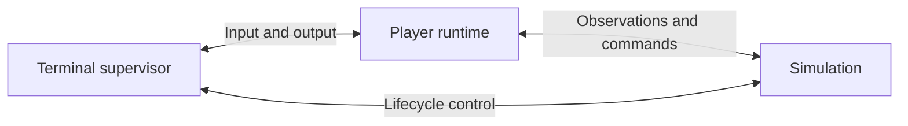

# Technical Foundations

Related: [[Game Design]] · [[First Mission]] · [[First Prototype]] · [[Developing Game Objects]]

> [!abstract] Scope
> This page records the agreed technical direction and the boundaries still to specify. Detailed simulation, interpreter, API, and script-runtime designs will be written in separate pages later.

## Language and workspace

Python is the chosen language for the simulation and player code. Players edit ordinary Python scripts in a dedicated folder alongside the project, using their preferred external editor.

The player-facing API should provide type annotations and docstrings for IDE completion and inline reference documentation. Markdown documents provide concepts, explanations, and examples. Editor support depends on the player's chosen Python tooling.

There is no built-in documentation browser or interpreter help interface supplied by the game. Normal Python capabilities need not be artificially disabled.

Exact package layout, Python version, dependencies, and distribution method remain open.

## Launch and process architecture

The game targets Linux only. The player runs `./space-automation` from their preferred terminal. This single application launches three cooperating processes:

| Process | Responsibility |
| --- | --- |
| Terminal supervisor | Own terminal input/output, launch and supervise children, coordinate pause, save, shutdown, and recovery. |
| Player runtime | Load `main.py`, execute its lifecycle callbacks and interpreter submissions in the same live namespace. |
| Simulation | Own authoritative world state, validate commands, advance the clock and physical actions, and save/load the world. |



The terminal process uses Textual for a fixed bottom command field, a scrollable output panel, and a session-name/current-tick status bar. Its supervisor loop runs in a thread within that same process and exchanges input/output with the UI through queues. It still launches only two child processes. Python execution happens inside the player runtime. It must remain responsive if player code hangs. Separation permits detection and termination of a blocked runtime, but does not guarantee that arbitrary Python execution can safely resume after interruption.

### Communication

Use private Unix domain socket connections between the processes. D-Bus is not required. The starting proposal is length-prefixed JSON messages with request identifiers and an explicit protocol version. Transport details belong in a future communication specification; [[First Prototype]] defines a minimal scope to validate the architecture.

Exchange data, entity identifiers, and commands rather than live Python objects. The simulation alone owns physical state. Player objects remain inside the player runtime.

### Startup sequence

1. Launch the supervisor and its two children.
2. Load the last saved simulation state, or create the initial world.
3. Keep simulation time paused during initialization.
4. Expose the initial observations and expedition API to the player runtime.
5. Load the player's `main.py` and call `startup()` once.
6. If initialization succeeds, begin ticking and accept interpreter submissions.

An initialization failure leaves the session paused and reports the error. Resuming a save restores the world and ongoing physical actions, not Python call stacks. There is no offline progress in the starting design.

## One player entry point

The game supplies a minimal `main.py` in the player script folder. This is the only script with a game-managed lifecycle:

```python
from expedition import station

def startup():
    pass

def update(dt):
    pass
```

`startup()` initializes player code after loading the world and is called again when the entry point is explicitly reloaded. `update(dt)` runs once per simulation tick. Exact reload behavior and production tick duration remain to be specified.

All other organization belongs to the player. They may import modules, create controllers, implement signals, or build their own scheduler. The game does not attach scripts to equipment, discover controller classes, invoke their callbacks, or manage their registrations.

For example, the player may choose this convention:

```python
from expedition import station
from controllers import RoverController

controllers = {}

def startup():
    for rover in station.get_fleet():
        controllers[rover.id] = RoverController(rover)

def update(dt):
    for controller in controllers.values():
        controller.update(dt)
```

`RoverController` and its `update()` method are player code, not required game interfaces. Newly constructed equipment becomes accessible through the API; deciding how to control it is the player's responsibility.

## Interpreter and live manual interaction

Interpreter submissions execute in the actual global namespace of `main.py`, not a copied dictionary. This makes its variables, functions, and imported modules available directly:

```python
print(station.get_fleet()[0].status)
controllers["rover-1"].display_status()
controllers["rover-1"].automation_enabled = False
```

Assignments must affect the globals subsequently read by `update()`. A player method is allowed to issue commands regardless of its name: calling movement inside `display_status()` submits movement normally.

No map, fleet dashboard, or custom status formatter is supplied. The `station` object represents the remote connection to planetary equipment, not orbital production.

The runtime serializes interpreter execution and the two game lifecycle callbacks. Player-defined event dispatch and controller ordering are the player's responsibility. Manual and automated commands have equal authority; the documented execution order determines which request arrives first.

An exception escaping `startup()`, `update()`, or interpreter execution is reported with a traceback. The proposed recovery policy pauses the simulation for inspection. Accepted actions are not silently undone.

## World commands and observations

Player API actions submit commands rather than directly modifying authoritative simulation state. Local controller parameter changes happen in player code; physical actions are validated and executed by the simulation.

Command acceptance and action completion are separate events. An accepted movement order does not imply arrival. A query immediately after submitting movement does not imply a changed position.

The simulation must expose rejection reasons and observable action state. The starting proposal makes command acceptance synchronous: the API waits for an acceptance or rejection response, while the action itself completes over simulation time. The simulation must continue servicing command requests while awaiting callback completion to avoid deadlock. Observation properties read a consistent local snapshot.

Consistent observations, command ordering, and the boundary between ticks must be defined together in the future simulation and API specifications.

## Movement contract

Positions use continuous 2D coordinates in meters. The API exposes `Vector2` values and a vehicle-specific `max_speed` in meters per tick:

```python
rover.move(direction, speed)
```

The simulation normalizes a nonzero direction vector, so its magnitude does not increase travel distance. Requested speed above `rover.max_speed` is capped to that maximum. Destination-based navigation, including `move_to(destination)`, remains player-written.

For the prototype, each accepted request applies to one tick only:

```text
position_next = position + normalized(direction) * min(speed, max_speed)
```

Speed is already in meters per tick, so this displacement is not multiplied by `dt` in seconds. Without an accepted movement request, the rover stays in place that tick. There is no inertia or multi-tick movement job. Player automation issues new movement requests each tick to keep moving.

Negative or non-finite speeds and zero or non-finite directions are invalid. Zero speed with a valid direction is an accepted no-displacement request. These detailed validation choices are prototype rules, subject to later API refinement.

### Multiple movement requests in one tick

**The first valid movement command accepted for a rover in a tick wins.** Subsequent valid movement requests for that rover in that tick are rejected as `movement_already_requested`, regardless of their origin.

```python
rover.move(direction_a, speed_a)  # Accepted if valid.
rover.move(direction_b, speed_b)  # Rejected in the same tick.
```

Each rover has its own slot. Invalid requests do not consume it; accepted zero-speed requests do. Slots reset at the next tick. There is no movement-related busy state carried into the next tick.

Manual intervention has no special priority. Disabling automation does not withdraw a request already accepted for the current tick.

The prototype uses no grid, obstacles, or collision resolution. Those may be introduced later without making destination navigation a built-in capability.

## Simulation time and scheduling

Use coordinated simulation steps. For each step, expose the current observations, execute interpreter submissions admitted at the input boundary, call `main.update(dt)`, finish processing commands, and advance the world by a fixed simulation duration.

Input arriving after the boundary waits for the next execution opportunity. An unfinished input line does not block ticking. Callback and interpreter execution do not overlap.

Slow player code slows real-time execution rather than increasing `dt` or skipping updates. A hung runtime prevents the coordinated step from completing; the supervisor must allow recovery. No physical advance happens while waiting for player execution to finish.

Support continuous execution, pause, and explicit stepping. Simulation time excludes time spent paused. Commands entered while paused share the upcoming tick's admission slot; additional submissions do not reset it. Precise boundary and admission behavior is scoped in [[First Prototype]] and will be expanded in the simulation specification.

## Reload and persistence

The game manages the lifecycle of `main.py` only. It does not replace individual player controllers or repair arbitrary references to them.

An explicit reload must invoke `startup()` again. Handling imported module caches, global variables, stale interpreter references, reload failures, and pending commands requires further design. Live edits to player variables have no implied persistence across reload or process restart.

Save the authoritative world, including simulation time and ongoing actions. An explicit mechanism for persistent player data may be added later; arbitrary Python stacks and objects are not automatically saved.

## Future technical pages

The next documents should specify:

| Planned page | Decisions to cover |
| --- | --- |
| Simulation | Tick phases, clock, world state, action durations, deterministic ordering, save/load. |
| Interpreter | Live object access, command execution, pausing, output, interruption, errors. |
| Player API | Observations, commands, validation, outcomes, units, equipment capabilities. |
| Script Runtime | Entry-point lifecycle, execution order, imports, reload, state, fault recovery. |
| Process Communication | Transport, snapshots, command sequencing, disconnection, synchronization. |

These detailed pages are intentionally not created yet. [[First Prototype]] records the implemented first prototype; prototype constants and protocol choices are not final gameplay balance.

## Gameplay extension boundary

Authoritative equipment classes live in `game/objects/`. The world owns the object collection and clock; object methods own gameplay rules. One generic dispatcher handles exposed commands for every registered type.

`observed()` fields define public snapshots and `@command` methods define player calls. A developer tool generates typed wrappers and exports, preserving IDE support without hand-maintaining remote implementations. Generic persistence saves each object's dataclass fields. See [[Developing Game Objects]] for the complete workflow and the solar-panel example.
